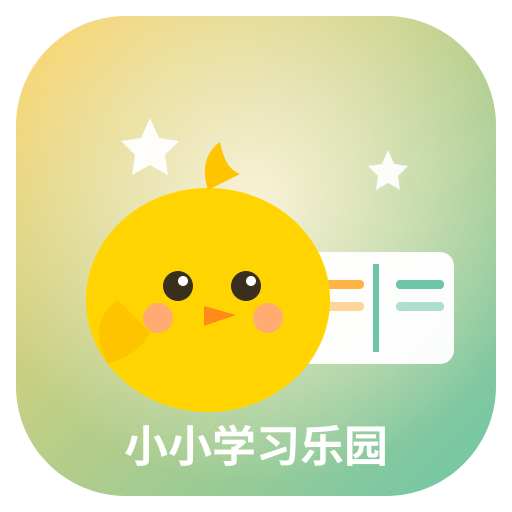
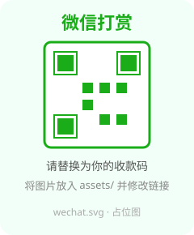
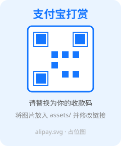

<div align="center">



# 小小学习乐园

### 小学低年级（一年级上册·人教版）游戏化自适应学习平台 · 网页原型

把 **艾宾浩斯遗忘曲线（SRS）**、**人教版同步**、**家长自定义题库**、**习惯打卡** 与 **「积分—宠物养成」激励机制** 融为一体的儿童学习乐园。

[](https://juntiy.github.io/kid-learning-platform/)
[](LICENSE)
[](https://github.com/juntiy/kid-learning-platform/stargazers)
[](https://juntiy.github.io/kid-learning-platform/)
[]()
[]()

**[🌐 在线体验](https://juntiy.github.io/kid-learning-platform/) · [📦 源码仓库](https://github.com/juntiy/kid-learning-platform) · [🐛 问题反馈](https://github.com/juntiy/kid-learning-platform/issues)**

</div>

---

> 💡 这是一个 **单文件、零依赖、纯前端** 的可交互原型，用浏览器直接打开 `index.html` 即可体验，所有状态用 `localStorage` 持久化（刷新不丢）。适合先验证产品设计与交互手感；真正的数据隔离、SRS 调度引擎、家长登录鉴权等需要后端 + 数据库落地。

## ✨ 核心特性

### 🧒 孩子端
| 模块 | 说明 |
| --- | --- |
| 🏠 **首页** | 今日任务小火车（完成一项自动前进）、双线入口（同步刷题 / 专题突破）、学习数据看板、今日日期。 |
| 📚 **同步 / 专题刷题** | 语文·识字 / 英语·字母 / 思维·算术 / 古诗词 四大学科；SRS 到期复习卡带 🔔 标识（做对巩固记忆）。 |
| 🐣 **宠物王国** | 可互动 SVG 宠物、自定义名字、5 种基础宠物（小鸡 / 小狗 / 小猫 / 熊猫 / 长颈鹿）、饱腹度与经验条、积分商店喂养、等级指数递增。 |
| ⭐ **习惯打卡** | 孩子「申请打卡」→ 家长确认 → 积分入账（积分由家长设定）。 |
| 💥 **错题消灭营** | 连续错 2 次的题自动入营，重新做对「消灭」并拿双倍积分。 |
| 🔤 **英语字母** | 26 个字母大小写 + 音标 + 卡通图案 + 单词（点击听英文发音）；常用句型公式（I have / I like / Go to）可造句。 |
| 🧠 **思维训练** | 找规律 / 图形逻辑闯关（难度缓慢递增、末段多组图案 6 选 1）+ 记忆翻牌游戏。 |
| 🔡 **拼音认识** | 单韵母 / 声母 / 复韵母，带 **四声**；专用中文发音（与英文字母名彻底分开）+ 拼读「拼一拼」演示。 |
| 🌸 **古诗词（听读）** | 一年级上册·人教版篇目，听朗读、跟读，**不要求写汉字**。 |

### 👨‍👩‍👧 家长端（带锁入口，与孩子的模块分隔）
| 模块 | 说明 |
| --- | --- |
| ✏️ **题库录入** | 手动录入 + CSV 批量导入（带下载模板），自定义题自动流入孩子对应学科。 |
| ⭐ **习惯管理** | 自定义打卡内容、图标与积分奖励。 |
| 👧 **孩子管理** | 修改头像（预设卡通动物点选）/ 姓名 / 年级 / 教材版本，添加 / 删除 / 切换孩子。 |
| 🩺 **分析报表** | 记忆遗忘健康度热力图（示例数据，真实值由 SRS 引擎计算）。 |
| 🖨️ **错题打印** | 一键生成错题本并 `打印 / 导出 PDF`。 |

## 🛠 技术栈

- **前端**：纯原生 HTML + CSS + JavaScript（单文件 `index.html`，零构建、零依赖）
- **持久化**：浏览器 `localStorage`
- **发音**：浏览器内置语音合成（Web Speech API）
- **宠物/插画**：内联 SVG（无需外部资源）
- **托管**：GitHub Pages（静态站点，免服务器）

## 📁 目录结构

```
kid-learning-platform/
├── index.html        # 主程序（孩子端 + 家长端，单文件）
├── README.md         # 本文件
├── LICENSE           # MIT License
├── .gitignore
└── assets/
    ├── logo.svg      # 项目 Logo
    ├── wechat.svg    # 微信打赏占位图
    └── alipay.svg    # 支付宝打赏占位图
```

## 🚀 本地运行

直接用浏览器打开 `index.html` 即可（推荐 Chrome / Edge / Safari，平板端体验最佳）。

**发音说明**：依赖浏览器内置语音合成（Web Speech API）
- 英语用 `en-US` 朗读字母名 / 单词；
- 拼音采用拼音教学读法（声母 bō/pō…、韵母带四声），与英文字母名不是一套。
- 个别设备若未安装中文语音包，拼音会不出声；正式产品建议替换为录制真人音频。

## ☁️ 部署到 GitHub Pages

本仓库即已按此方式部署，在线地址：**[https://juntiy.github.io/kid-learning-platform/](https://juntiy.github.io/kid-learning-platform/)**

如需自行部署：

1. 推送文件到仓库（默认分支 `main`、根目录）：
   ```bash
   git add index.html README.md LICENSE assets/
   git commit -m "更新原型"
   git push
   ```
2. 仓库 **Settings → Pages** → Source 选 **Deploy from a branch** → Branch 选 **main** / 根目录 **/ (root)** → 保存。
3. 几分钟后访问 `https://<用户名>.github.io/<仓库名>/`。

> 提示：单文件站点无需任何构建步骤。若仓库名含下划线导致主题资源问题，可在根目录放一个空的 `.nojekyll` 文件。

## ❤️ 打赏支持

如果这个项目对你和孩子有帮助，欢迎请作者喝杯咖啡 ☕ 支持继续完善～

<div align="center">


&nbsp;&nbsp;&nbsp;


</div>

> 📌 上图为占位图。**替换为你的收款码**：把自己的微信 / 支付宝收款码截图导出为图片，重命名为 `wechat.png` / `alipay.png` 放入 `assets/`，然后把 README 中对应 `` 改成 `` 即可。

## 📜 License

本项目基于 [MIT License](LICENSE) 开源，可自由使用、修改、分发。

## ⚠️ 免责声明

- 本仓库为 **产品设计原型**，内置题库、热力图、孩子数据均为前端演示数据，不代表真实教学大纲的完整覆盖。
- 所有孩子学习数据仅存储于其本人设备浏览器（localStorage），不上传任何服务器。
- 拼音 / 英语发音为浏览器合成音，正式教学请使用录制真人音频或权威语音包。

---

<div align="center">

**小小学习乐园** · 让低年级的孩子，在游戏里爱上学习 🌈

</div>
